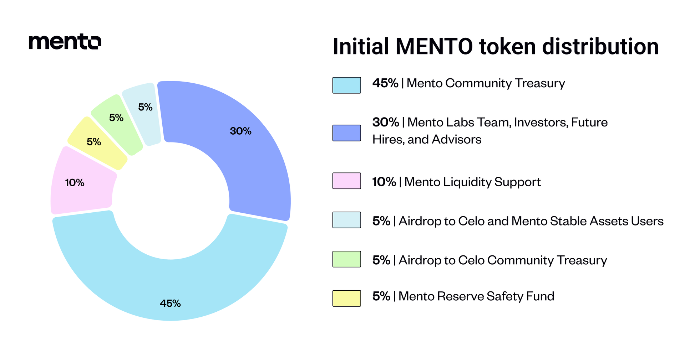
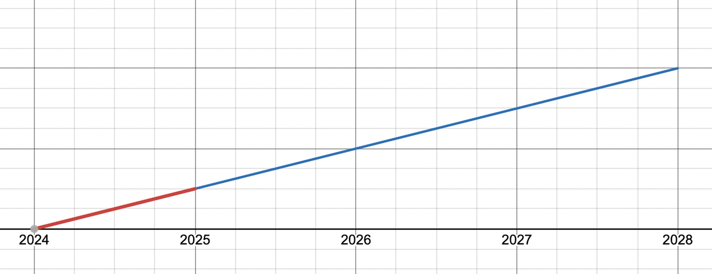

# MENTO Token

## Total Supply

The MENTO token has a maximum **total supply of 1,000,000,000 (one billion)** tokens. The rest of the tokens are subject to either vesting periods (i.e., team, investors, partners) or a long-term emission schedule detailed in the [Mento Community Treasury](mento-token.md#mento-community-treasury-45-allocation) section below

## Initial Token Distribution

Initial distribution as [defined by the Mento Community](https://forum.celo.org/t/mento-spin-off-and-launch-of-the-mento-token/7747):

<figure><figcaption>
Initial MENTO Token Distribution
</figcaption></figure>

### Mento Community Treasury \[45% Allocation]

**Purpose:** The Mento community can spend tokens from the treasury to foster the protocol's development. Every decision to spend tokens from the treasury is subject to governance approval. The tokens could be spent on grants, liquidity incentivization programs, or whatever else the community decides. To incorporate the community's will into a legal body, the Mento Protocol Foundation was set up.

**Distribution:** 450M tokens (45% of total supply) with 50M available at [the Genesis Block](https://celoscan.io/block/25901546). The tokens will be emitted to the treasury via an exponential decay function with a half-life of 10 years. The emission schedule over time is visualized in the graph below:

<figure><figcaption>
MENTO Total Supply over time
</figcaption></figure>

**Voting rights:** No, the tokens inside the community treasury can not vote.

### Mento Labs Team, Investors, Future Hires, Advisors \[30% Allocation]

**Purpose:** Reward core contributors, investors, and advisors. Attract the best talent to contribute to the protocol in the future.

**Distribution:** 300M tokens (30% of total supply). Existing Mento Labs employees, investors, and advisors will receive their MENTO tokens split into two parts:

<figure><figcaption></figcaption></figure>

1.  <mark style="color:red;">**veMENTO portion**</mark> (25% of the allocation)

    To seed voting power to the team and investors, 25% of their allocation will be distributed as veMENTO locked for 1 year so they can vote from day one using delegation. However, beneficiaries will only get full control of the lock after their 1 year cliff period has passed.
2.  <mark style="color:blue;">**MENTO portion**</mark> (75% of the allocation)

    75% distributed as MENTO with a 1-year delay, accounting for the 25% veMENTO received in the first year, followed by 3 years linear vesting.

**Voting rights:** Yes, with the 25% veMENTO portion of their total allocation.

### Mento Liquidity Support \[10% Allocation]

**Purpose:** Funding mission-aligned initiatives supporting the liquidity of the MENTO token and Mento Protocol stablecoins.

**Distribution:** 100M (10% of total supply)

**Voting rights:** No

### Airdrop to Celo and Mento Stable Assets users \[5% Allocation]

**Purpose:** Reward existing community members and users for their past contributions to the development and usage of Mento stable assets and the Celo ecosystem overall.

**Distribution:** 50M tokens (5% of total supply). Eligible address owners can claim their allocation, which they will receive as locked veMENTO vesting over 2 years with a linear unlock. Read the [Airdrop](https://app.gitbook.com/o/oiWI2eFpemrjyHvmX6xL/s/fHYZIGlFVI2XkPqpDQjn/\~/changes/58/governance/airdrop-ep.-1) section for more details.

**Voting rights:** Yes.

### Airdrop to Celo Community Treasury \[5% Allocation]

**Purpose:** Long-term incentive alignment between the Celo and Mento communities.

**Distribution:** 50M (5% of total supply) with a 2-year delay followed by a 6-year linear vesting period.

**Voting rights:** No

### Mento Reserve Safety Fund \[5% Allocation]

**Purpose:** For emergencies. For example, these funds could be used as stablecoin collateral in worst-case scenarios, such as the permanent depeg of primary collateral (USDC, DAI, …), through credit default events, exploits, etc.

**Distribution:** 50M (5% of fully diluted supply)

**Voting rights:** No

## Transferability

At [the genesis block](https://celoscan.io/block/25901546), MENTO tokens will initially be non-transferable. Eligible airdrop participants can claim their allocation as locked veMENTO and participate in governance but not transfer or sell their tokens.

In the future, Mento Governance can decide to enable the token's transferability. To do so, a community member will have to create a governance proposal, which the community will have to vote in favor of.
