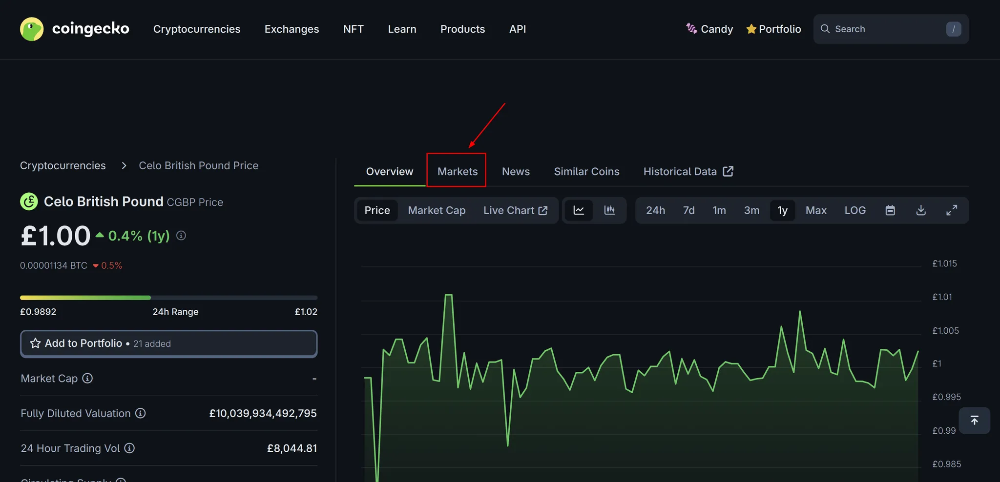

# Voting Process

## Introduction

Voting is how you shape Mento's future. Every proposal that affects the protocol, from parameter adjustments to treasury allocations, requires community approval through on-chain voting. This guide walks you through casting votes, understanding your influence, and tracking proposal outcomes.

## Finding Active Proposals

Navigate to [governance.mento.org](https://governance.mento.org/) to view all proposals.

<figure><figcaption></figcaption></figure>

### Proposal List

The proposals section shows each proposal with:

* **Status Badge**: Active, Defeated, Executed, etc.
* **Title**: Clear description of the proposal
* **Vote Summary**: For/Against/Abstain counts
* **Participation**: Number of voters and addresses

Proposals are listed chronologically with the most recent first.

## How to Vote

### Step 1: Select a Proposal

Click any proposal from the list to view its details. Active proposals display "Active" while completed ones show their final status.

<figure><figcaption></figcaption></figure>

### Step 2: Review Proposal Information

Each proposal page includes:

**Header Information**

* Proposer address
* Proposed date and voting deadline
* Current status (Active, Defeated, etc.)

**Voting Metrics**

* Time remaining
* Quorum status and requirement
* Your voting power for this proposal
* Total votes cast

**Proposal Content**

* Description and rationale
* Technical specifications
* Expected impacts
* Forum discussion link

<figure><figcaption></figcaption></figure>

### Step 3: Cast Your Vote

For active proposals, three voting options appear:

* **Vote YES** - Support the proposal
* **Abstain** - Neutral
* **Vote NO** - Oppose the proposal

<figure><figcaption></figcaption></figure>

Click your choice to initiate the voting transaction.

***

### Step 4: Confirm Transaction

1. Review your vote choice in your wallet
2. Confirm the transaction
3. Wait for on-chain confirmation
4. The interface updates to show "Your vote: \[CHOICE]"

<figure><figcaption></figcaption></figure>

Your vote is permanent and cannot be changed.

## Understanding Voting Power

### How Your Weight is Calculated

**Snapshot Mechanism**

* Each proposal captures veMENTO balances at proposal creation block
* Your voting power = your veMENTO balance at that specific block
* Later changes to veMENTO balances don't affect voting power for existing proposals

**Display Format**

* Individual voting power shown as "Your Voting Power: X veMENTO"
* Total participation shown as "Total Votes: Y veMENTO"
* Your contribution visible in the Participants section

### Quorum Requirements

Proposals must meet minimum participation thresholds:

**Quorum Display**

* "Quorum not reached" appears if threshold unmet
* "Quorum reached" shows once minimum veMENTO participates
* Exact requirement shown (e.g., "Min. 4.6M veMENTO")
* Quorum is dynamically calculated as a percentage of total veMENTO supply

<figure><figcaption></figcaption></figure>

**Outcome Determination**

* Must reach quorum AND have majority support
* Failed quorum = automatic defeat regardless of vote ratio
* Successful proposals must then be queued in order to enter the timelock period

## Tracking Results

### Live Voting Progress

During active voting, the interface displays:

**Vote Distribution**

* Percentage breakdown (Yes/No/Abstain)
* Visual progress bar showing vote weight
* Real-time updates as votes are cast

<figure><figcaption></figcaption></figure>

### **Participation Metrics**

* Number of unique voters
* Total veMENTO voted vs. available
* Individual voter addresses and weights

<figure><figcaption></figcaption></figure>

### Understanding Status Changes

**Active** → Voting period open \
**Cancelled** → Vetoed proposals \
**Success →** Approved (Majority yes & quorum reached) \
**Queued** → In timelock, awaiting execution \
**Executed** → Changes implemented on-chain \
**Defeated** → Failed (low support or no quorum)

### Post-Voting Timeline

1. **Voting Ends** - No new votes accepted
2. **Result Calculation** - Final tally determines outcome
3. **Timelock Period** (2 days) - Successful proposals wait
4. **Watchdog Review** - Safety check window
5. **Execution** - Changes go live on-chain

## Best Practices

### Effective Participation

**Before Voting**

* Read the complete proposal
* Check forum discussions
* Understand technical implications
* Consider long-term impacts

**When Voting**

* Vote early to avoid missing deadlines
* Ensure sufficient CELO for gas
* Verify transaction confirmation

**After Voting**

* Monitor proposal progress
* Participate in implementation discussions
* Share feedback for future proposals

### Building Governance Reputation

* Vote consistently on proposals
* Provide rationale in forums
* Support well-crafted proposals
* Help improve weak proposals
* Maintain long-term perspective

## Common Questions

<strong>Can I change my vote?</strong>

No, all votes are final once submitted.

<strong>What if I miss the voting period?</strong>

&#x20;You cannot vote after the deadline. Set reminders for important proposals.

<strong>Why don't I see my veMENTO balance?</strong>

Your voting power is captured at proposal creation. Check if you locked MENTO after the proposal was submitted.

<strong>How do I know if my vote counted?</strong>

&#x20;Look for "Your vote: \[CHOICE]" on the proposal page and your address in the Participants list.

